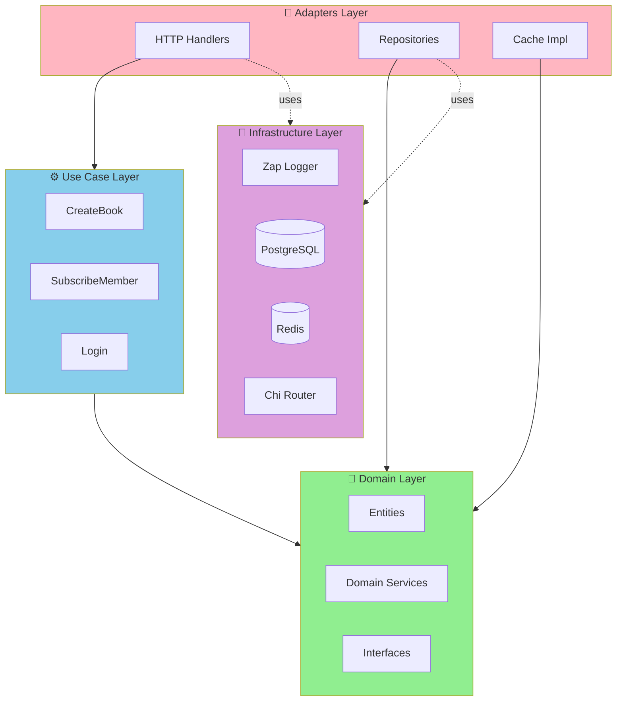
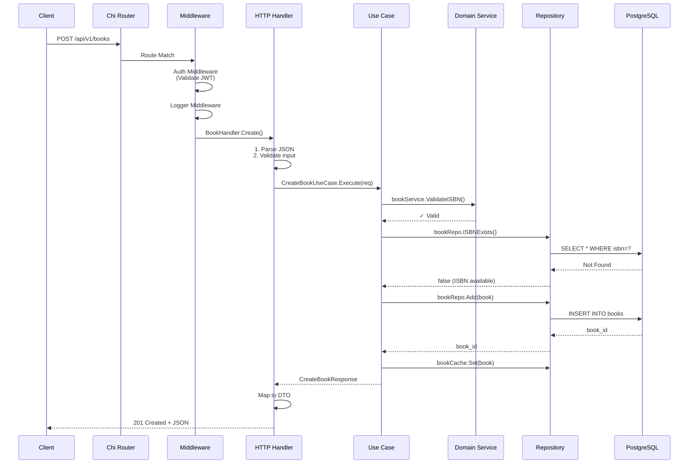
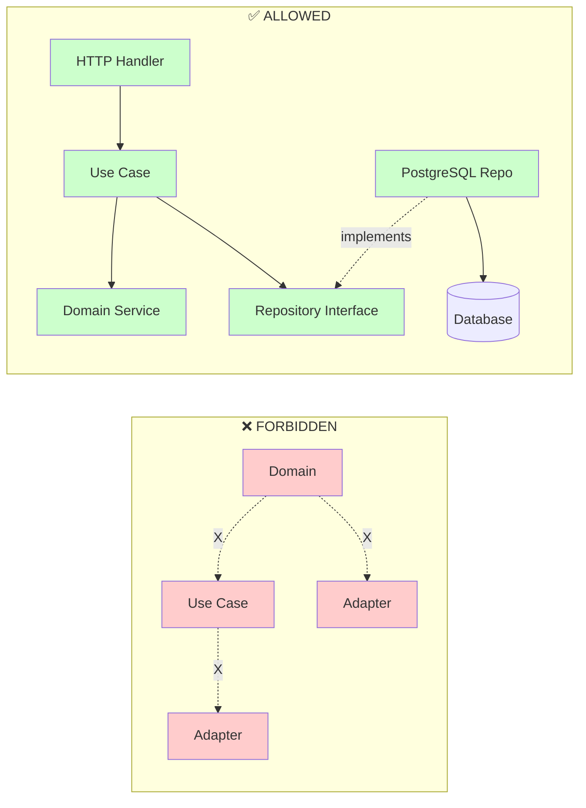
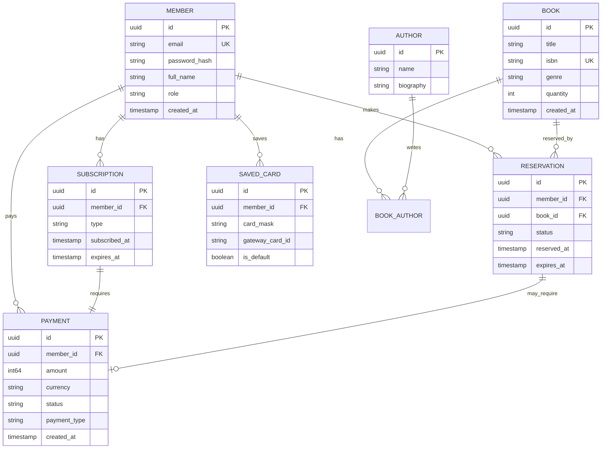
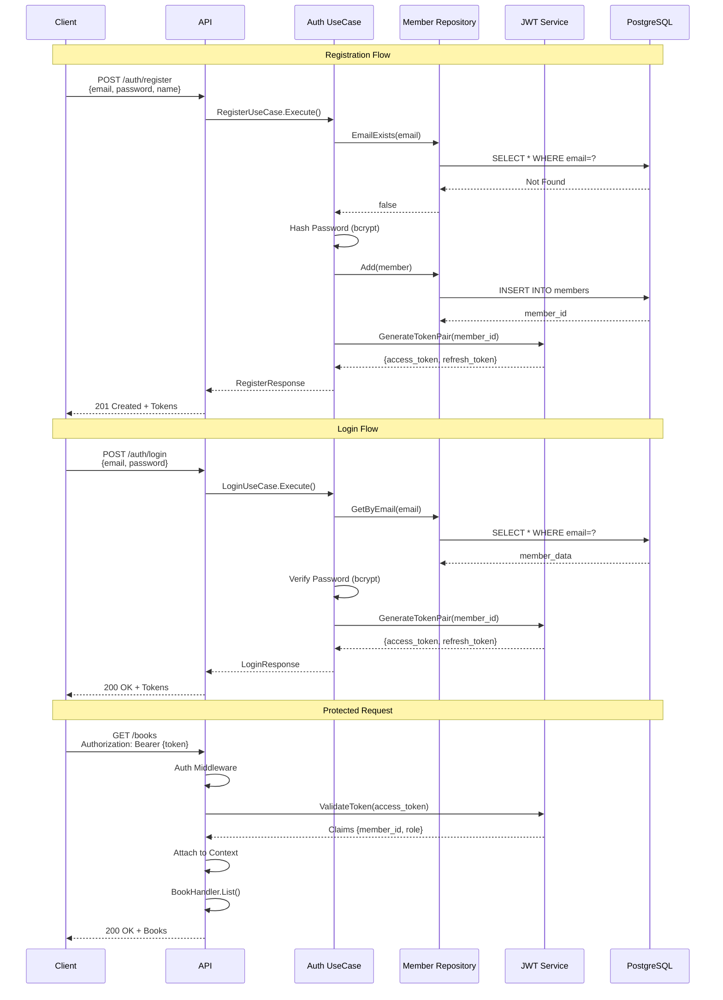

# Architecture Guide

> **Clean Architecture with Bounded Context Organization**

**Last Updated:** October 11, 2025 (Post Phase 1-2 Refactoring)

## Overview

This project follows **Clean Architecture** (also known as Hexagonal or Onion Architecture) organized into **Bounded Contexts** (vertical slices). Each domain is self-contained with its own domain logic, use cases, HTTP handlers, and repositories.

**Key Architectural Decisions:**
- ✅ Bounded context organization (completed Phases 2.1-2.5)
- ✅ DTO colocation with handlers (Phase 1.1: Payment DTOs split by subdomain)
- ✅ Mocks colocated in bounded contexts (Phase 2.1)
- ✅ Standardized import aliases (Phase 2.2)

## Core Principles

### Dependency Rule

**Dependencies point INWARD only:**

```
Domain ← Use Case ← Adapters ← Infrastructure
```

- **Domain** has ZERO external dependencies
- **Use Cases** depend only on Domain
- **Adapters** depend on Use Cases and Domain (via interfaces)
- **Infrastructure** can depend on any layer

### Layer Responsibilities



## Directory Structure

### Bounded Context Organization

Each domain is a self-contained **bounded context** with vertical slice organization:

```
internal/
├── books/                     # 📚 Books Bounded Context
│   ├── domain/               # Business logic (zero external deps)
│   │   ├── book/             # Book subdomain
│   │   │   ├── entity.go     # Book entity
│   │   │   ├── service.go    # Business rules (ISBN validation)
│   │   │   ├── repository.go # Repository interface
│   │   │   └── cache.go      # Cache interface
│   │   └── author/           # Author subdomain
│   │       ├── entity.go
│   │       ├── repository.go
│   │       └── cache.go
│   ├── operations/           # Use cases (orchestration)
│   │   ├── create_book.go    # Book operations
│   │   ├── update_book.go
│   │   ├── list_books.go
│   │   └── author/           # Author operations subdomain
│   │       └── list_authors.go
│   ├── http/                 # HTTP handlers
│   │   ├── handler.go        # Main handler + Routes()
│   │   ├── crud.go           # Create, update, delete
│   │   ├── query.go          # Get, list
│   │   ├── dto.go            # HTTP DTOs (colocated)
│   │   └── author/           # Author handlers subdomain
│   │       └── handler.go
│   └── repository/           # Data persistence
│       ├── book.go           # PostgreSQL implementation
│       ├── author.go
│       ├── memory/           # In-memory for testing
│       │   ├── book.go
│       │   └── author.go
│       └── mocks/            # Auto-generated mocks (Phase 2.1)
│           ├── mock_book_repository.go
│           └── mock_author_repository.go
│
├── members/                   # 👥 Members Bounded Context
│   ├── domain/
│   │   ├── entity.go         # Member entity
│   │   ├── service.go        # Subscription pricing logic
│   │   └── repository.go     # Repository interface
│   ├── operations/
│   │   ├── auth/             # Authentication subdomain
│   │   │   ├── register.go
│   │   │   ├── login.go
│   │   │   ├── refresh.go
│   │   │   └── validate.go
│   │   ├── profile/          # Profile management subdomain
│   │   │   ├── get_member_profile.go
│   │   │   └── list_members.go
│   │   └── subscription/     # Subscription subdomain
│   │       └── subscribe_member.go
│   ├── http/
│   │   ├── dto.go            # Member DTOs
│   │   ├── auth/             # Auth handlers
│   │   │   └── handler.go
│   │   └── profile/          # Profile handlers
│   │       └── handler.go
│   └── repository/
│       ├── member.go          # PostgreSQL implementation
│       ├── memory/
│       │   └── member.go
│       └── mocks/             # Auto-generated mocks (Phase 2.1)
│           └── mock_member_repository.go
│
├── payments/                  # 💳 Payments Bounded Context
│   ├── domain/
│   │   ├── payment.go        # Payment entity
│   │   ├── saved_card.go     # SavedCard entity
│   │   ├── receipt.go        # Receipt entity
│   │   ├── service.go        # Payment business rules
│   │   └── repository.go     # 4 repository interfaces
│   ├── operations/
│   │   ├── payment/          # Payment subdomain
│   │   │   ├── initiate_payment.go
│   │   │   ├── verify_payment.go
│   │   │   ├── handle_callback.go
│   │   │   ├── cancel_payment.go
│   │   │   └── refund_payment.go
│   │   ├── savedcard/        # Saved card subdomain
│   │   │   ├── list_saved_cards.go
│   │   │   ├── delete_saved_card.go
│   │   │   └── pay_with_saved_card.go
│   │   └── receipt/          # Receipt subdomain
│   │       ├── generate_receipt.go
│   │       ├── get_receipt.go
│   │       └── list_receipts.go
│   ├── http/                 # HTTP handlers with subdomain-specific DTOs (Phase 1.1)
│   │   ├── payment/
│   │   │   ├── handler.go
│   │   │   ├── dto.go        # Payment-specific DTOs (626 lines)
│   │   │   ├── initiate.go
│   │   │   ├── callback.go
│   │   │   └── query.go
│   │   ├── savedcard/
│   │   │   ├── handler.go
│   │   │   ├── dto.go        # Card-specific DTOs (29 lines)
│   │   │   └── crud.go
│   │   └── receipt/
│   │       ├── handler.go
│   │       ├── dto.go        # Receipt-specific DTOs (101 lines)
│   │       └── handler.go
│   ├── repository/
│   │   ├── payment.go        # 4 PostgreSQL implementations
│   │   ├── saved_card.go
│   │   ├── receipt.go
│   │   ├── callback_retry.go
│   │   └── mocks/            # Auto-generated mocks (Phase 2.1)
│   │       ├── mock_payment_repository.go
│   │       ├── mock_saved_card_repository.go
│   │       ├── mock_receipt_repository.go
│   │       └── mock_callback_retry_repository.go
│   └── gateway/              # External payment gateway integration
│       └── epayment/         # epayment.kz adapter
│           ├── gateway.go
│           └── payment.go
│
├── reservations/              # 📖 Reservations Bounded Context
│   ├── domain/
│   │   ├── entity.go
│   │   ├── service.go        # Reservation business rules
│   │   └── repository.go
│   ├── operations/
│   │   ├── create_reservation.go
│   │   ├── cancel_reservation.go
│   │   ├── get_reservation.go
│   │   └── list_member_reservations.go
│   ├── http/
│   │   ├── handler.go
│   │   ├── dto.go
│   │   ├── crud.go
│   │   └── query.go
│   └── repository/
│       ├── reservation.go
│       └── mocks/            # Auto-generated mocks (Phase 2.1)
│           └── mock_reservation_repository.go
│
├── adapters/                  # 🔌 Shared Adapters
│   ├── http/
│   │   ├── handlers/         # Base handler utilities
│   │   │   └── base.go      # RespondJSON, RespondError, etc.
│   │   ├── middleware/       # Shared middleware
│   │   │   ├── auth.go
│   │   │   ├── logger.go
│   │   │   ├── validator.go
│   │   │   └── error.go
│   │   ├── dto/              # Shared error DTOs
│   │   │   └── error.go
│   │   └── router.go         # Route registration
│   └── repository/
│       ├── repository.go     # Repository container
│       └── postgres/         # Shared PostgreSQL utilities
│           ├── base.go       # Generic BaseRepository
│           └── helpers.go
│
├── usecase/                   # 🎯 Use Case Container (orchestration)
│   ├── container.go          # DI container (groups all use cases)
│   ├── book_factory.go       # Book use case factory
│   ├── auth_factory.go       # Auth use case factory
│   ├── payment_factory.go    # Payment use case factory
│   └── reservation_factory.go # Reservation use case factory
│
└── infrastructure/            # 🔧 Technical Infrastructure (shared)
    ├── auth/
    │   ├── jwt.go            # JWT token management
    │   └── password.go       # Password hashing
    ├── store/
    │   ├── postgres.go       # Database connection
    │   └── redis.go          # Cache connection
    ├── server/
    │   └── server.go         # HTTP server setup
    └── app/
        └── app.go            # Application bootstrap
```

### Key Structural Patterns

**1. Package Names Within Bounded Contexts:**
- Generic names: `domain`, `operations`, `http`, `repository`
- Avoids naming conflicts through import aliases

**2. Import Alias Convention (Phase 2.2):**
```go
import (
    bookdomain "library-service/internal/books/domain/book"
    bookops "library-service/internal/books/operations"
    bookmocks "library-service/internal/books/repository/mocks"
)
```

**3. DTO Colocation (Phase 1.1):**
- DTOs colocated with HTTP handlers
- Large subdomains split into subdomain-specific DTOs
- Example: Payment DTOs split 754 lines → 3 files (payment, savedcard, receipt)

**4. Mock Generation (Phase 2.1):**
- Auto-generated via mockery
- Located in `{context}/repository/mocks/`
- Configured in `.mockery.yaml`

## Request Flow

Complete lifecycle of an HTTP request through Clean Architecture layers:



### Request Flow Steps

1. **Router** - Chi matches route `/api/v1/books` → `BookHandler`
2. **Middleware Chain** - Auth → Logger → Error Handler
3. **HTTP Handler** - Parse JSON, validate input
4. **Use Case** - Orchestrates business logic
5. **Domain Service** - Validates ISBN (business rules)
6. **Repository** - Persistence operations
7. **Response** - DTO mapping → JSON

## Key Architectural Patterns

### 1. Domain Services

**Purpose:** Encapsulate complex business logic that doesn't belong to a single entity

**Location:** `internal/domain/{entity}/service.go`

**Example - Book Service:**
```go
// internal/domain/book/service.go
type Service struct {}

func NewService() *Service {
    return &Service{}
}

// Pure business logic - no database, no HTTP
func (s *Service) ValidateISBN(isbn string) error {
    // ISBN-10 and ISBN-13 validation with checksum
    // ...
}

func (s *Service) CanBookBeDeleted(book Entity) error {
    // Business rule: can't delete if has active loans
    // ...
}
```

**Key Rules:**
- NO external dependencies (no database, no HTTP, no frameworks)
- Pure functions when possible
- 100% test coverage (easy to achieve with no deps)

### 2. Use Cases

**Purpose:** Orchestrate domain entities and services to accomplish business goals

**Location:** `internal/usecase/{entity}/{operation}.go`

**Example - Create Book Use Case:**
```go
// internal/usecase/bookops/create_book.go
type CreateBookUseCase struct {
    bookRepo    book.Repository     // Interface from domain
    bookCache   book.Cache          // Interface from domain
    bookService *book.Service       // Domain service
}

func (uc *CreateBookUseCase) Execute(ctx context.Context, req CreateBookRequest) (*book.Entity, error) {
    // 1. Validate using domain service
    if err := uc.bookService.ValidateISBN(req.ISBN); err != nil {
        return nil, err
    }

    // 2. Create entity
    newBook := book.NewEntity(req.Name, req.ISBN, req.Genre)

    // 3. Check business rules
    if err := uc.bookService.CanCreateBook(newBook); err != nil {
        return nil, err
    }

    // 4. Persist
    if err := uc.bookRepo.Create(ctx, newBook); err != nil {
        return nil, fmt.Errorf("creating book: %w", err)
    }

    // 5. Update cache
    uc.bookCache.Set(ctx, newBook.ID, newBook)

    return &newBook, nil
}
```

**Key Rules:**
- One use case = one file (Single Responsibility Principle)
- Depends only on interfaces (defined in domain)
- Orchestrates, doesn't contain business logic
- Returns domain entities, not DTOs

### 3. Repository Pattern

**Purpose:** Abstract data persistence from business logic

**Interface:** Defined in `internal/domain/{entity}/repository.go`
**Implementation:** In `internal/infrastructure/pkg/repository/{type}/{entity}.go`

```go
// Domain defines the contract
// internal/domain/book/repository.go
type Repository interface {
    Create(ctx context.Context, book Entity) error
    GetByID(ctx context.Context, id string) (Entity, error)
    Update(ctx context.Context, book Entity) error
    Delete(ctx context.Context, id string) error
    List(ctx context.Context, filter ListFilter) ([]Entity, error)
}

// Adapter implements it
// internal/infrastructure/pkg/repository/postgres/book.go
type PostgresBookRepository struct {
    db *sqlx.DB
}

func (r *PostgresBookRepository) Create(ctx context.Context, book domain.Entity) error {
    query := `INSERT INTO books (id, name, isbn, genre) VALUES ($1, $2, $3, $4)`
    _, err := r.db.ExecContext(ctx, query, book.ID, book.Name, book.ISBN, book.Genre)
    return err
}
```

**Benefits:**
- Domain is independent of database technology
- Easy to swap PostgreSQL for MongoDB (just change adapter)
- Easy to mock for testing

### 4. Dependency Injection

**Purpose:** Make dependencies explicit and testable

**Location:** `internal/usecase/container.go`

```go
// Container holds all use cases
type Container struct {
    CreateBook      *book.CreateBookUseCase
    GetBook         *book.GetBookUseCase
    RegisterMember  *auth.RegisterUseCase
    // ... other use cases
}

// Wire dependencies in constructor
func NewContainer(repos *Repositories, caches *Caches) *Container {
    bookService := book.NewService()
    memberService := member.NewService()

    return &Container{
        CreateBook: book.NewCreateBookUseCase(
            repos.Book,      // Repository interface
            caches.Book,     // Cache interface
            bookService,     // Domain service
        ),
        // ... wire other use cases
    }
}
```

**Bootstrap:** `internal/app/app.go`
```go
// Create all infrastructure
db := store.NewPostgres(cfg.Database)
redis := store.NewRedis(cfg.Redis)

// Create repositories
repos := &usecase.Repositories{
    Book:   postgres.NewBookRepository(db),
    Member: postgres.NewMemberRepository(db),
    Author: postgres.NewAuthorRepository(db),
}

// Create caches
caches := &usecase.Caches{
    Book:   rediscache.NewBookCache(redis),
    Author: rediscache.NewAuthorCache(redis),
}

// Wire everything
container := usecase.NewContainer(repos, caches, authSvcs)
```

### 5. Error Handling

**Domain Errors:** `pkg/errors/domain.go`
```go
var (
    ErrNotFound      = errors.New("resource not found")
    ErrAlreadyExists = errors.New("resource already exists")
    ErrValidation    = errors.New("validation failed")
    ErrUnauthorized  = errors.New("unauthorized")
)
```

**Error Wrapping:**
```go
// GOOD: Add context and wrap
if err := repo.Create(ctx, book); err != nil {
    return fmt.Errorf("creating book in database: %w", err)
}

// BAD: Lose context
if err := repo.Create(ctx, book); err != nil {
    return err
}
```

## Data Flow Example

**Creating a Book:**

```
1. HTTP Request
   ↓
2. HTTP Handler (adapters/http/handlers/book.go)
   - Parse JSON to DTO
   - Call use case
   ↓
3. Use Case (usecase/bookops/create_book.go)
   - Validate using domain service
   - Create entity
   - Save via repository
   - Update cache
   ↓
4. Repository (adapters/repository/postgres/book.go)
   - Execute SQL
   - Return result
   ↓
5. Response flows back
   Repository → Use Case → Handler → HTTP Response
```

**Key Points:**
- HTTP layer never talks to database directly
- Business logic never depends on HTTP
- Each layer has clear responsibility
- Easy to test each layer in isolation

## Testing Strategy

### Unit Tests (Domain)
```go
// internal/domain/book/service_test.go
func TestService_ValidateISBN(t *testing.T) {
    svc := NewService()
    
    tests := []struct {
        name    string
        isbn    string
        wantErr bool
    }{
        {"valid ISBN-13", "978-0-306-40615-7", false},
        {"invalid checksum", "978-0-306-40615-8", true},
    }
    
    for _, tt := range tests {
        t.Run(tt.name, func(t *testing.T) {
            err := svc.ValidateISBN(tt.isbn)
            if (err != nil) != tt.wantErr {
                t.Errorf("got error %v, wantErr %v", err, tt.wantErr)
            }
        })
    }
}
```

### Integration Tests (Use Cases)
```go
// internal/usecase/bookops/create_book_test.go
func TestCreateBook(t *testing.T) {
    // Use mocks
    mockRepo := mocks.NewMockRepository()
    mockCache := mocks.NewMockCache()
    svc := book.NewService()
    
    uc := NewCreateBookUseCase(mockRepo, mockCache, svc)
    
    // Test
    result, err := uc.Execute(ctx, CreateBookRequest{...})
    // Assert...
}
```

### API Tests (End-to-End)
```bash
# Use curl or HTTP test frameworks
curl -X POST http://localhost:8080/api/v1/books \
  -H "Authorization: Bearer $TOKEN" \
  -H "Content-Type: application/json" \
  -d '{"name":"Test Book","isbn":"9780132350884"}'
```

## Design Decisions

See [Architecture Decision Records](../docs/adr/) for detailed decisions:
- [ADR-001: Clean Architecture](../docs/adr/001-clean-architecture.md)
- [ADR-002: Domain Services](../docs/adr/002-domain-services.md)
- [ADR-003: Dependency Injection](../docs/adr/003-dependency-injection.md)

## Common Patterns

### Adding a New Domain

1. **Create structure:**
   ```bash
   mkdir -p internal/domain/loan
   touch internal/domain/loan/{entity.go,service.go,repository.go,dto.go}
   ```

2. **Define entity and business rules** (service.go)

3. **Define repository interface** (repository.go)

4. **Create use cases:**
   ```bash
   mkdir -p internal/usecase/loan
   touch internal/usecase/loan/{create_loan.go,return_loan.go}
   ```

5. **Implement repository:**
   ```bash
   touch internal/infrastructure/pkg/repository/postgres/loan.go
   ```

6. **Add HTTP handlers:**
   ```bash
   touch internal/infrastructure/pkg/handler/loan.go
   touch internal/infrastructure/pkg/dto/loan.go
   ```

7. **Wire in container:** Update `internal/usecase/container.go`

### Changing Databases

To switch from PostgreSQL to MongoDB:
1. Implement `book.Repository` in `adapters/repository/mongo/`
2. Update `app.go` to use MongoDB repository
3. Domain and use cases remain unchanged!

## Performance Considerations

- **Caching:** Read-through cache pattern in use cases
- **Connection Pooling:** Configured in infrastructure layer
- **N+1 Queries:** Use eager loading in repositories
- **Indexes:** Defined in migrations

## Dependency Flow

Visual representation of allowed dependencies between layers:



### Dependency Rules

✅ **Allowed:**
- Adapters → Use Cases
- Use Cases → Domain
- Infrastructure → Anything
- Outer layers → Inner layers

❌ **Forbidden:**
- Domain → Use Cases
- Domain → Adapters
- Use Cases → Adapters
- Inner layers → Outer layers

## Entity Relationships

Domain model showing relationships between core entities:



## Authentication Flow

JWT-based authentication process:



## References

- [The Clean Architecture - Uncle Bob](https://blog.cleancoder.com/uncle-bob/2012/08/13/the-clean-architecture.html)
- [Hexagonal Architecture](https://alistair.cockburn.us/hexagonal-architecture/)
- [Domain-Driven Design](https://martinfowler.com/bliki/DomainDrivenDesign.html)
